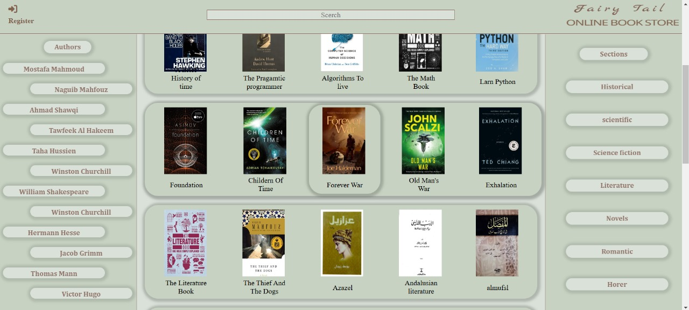
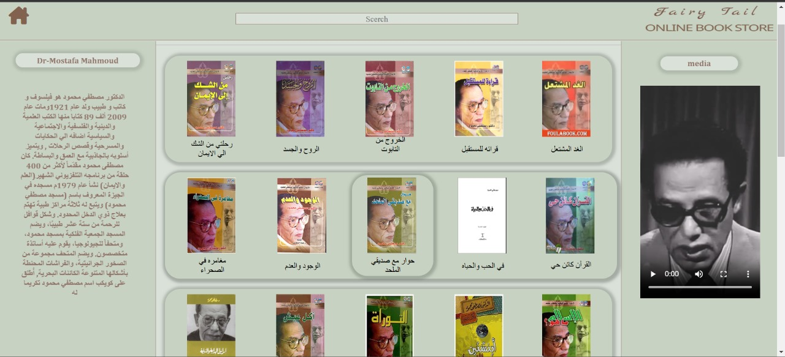
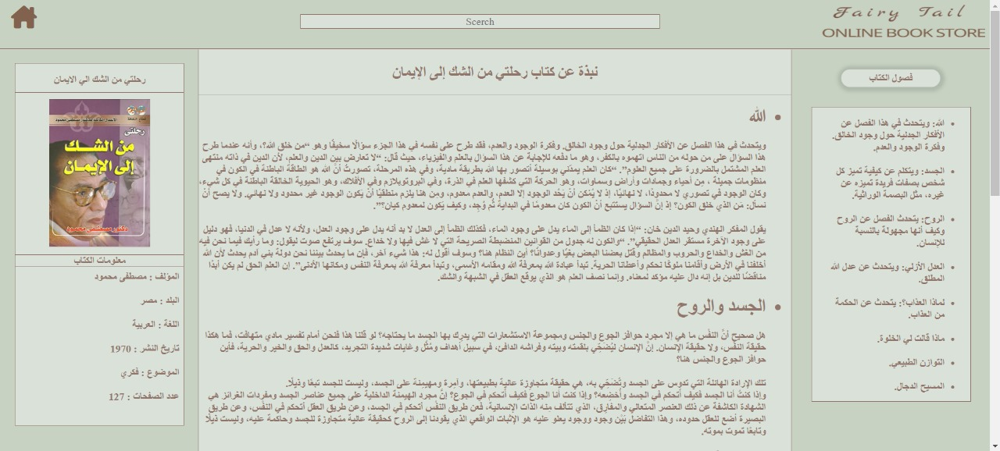
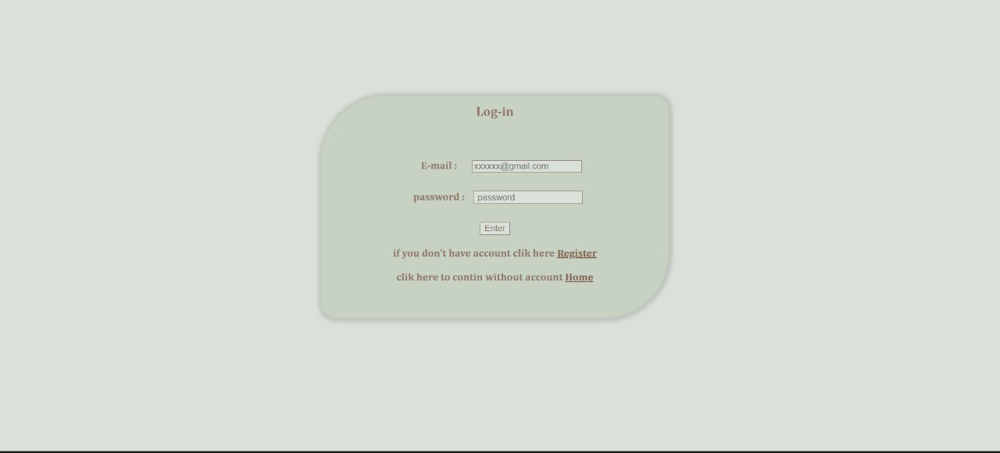
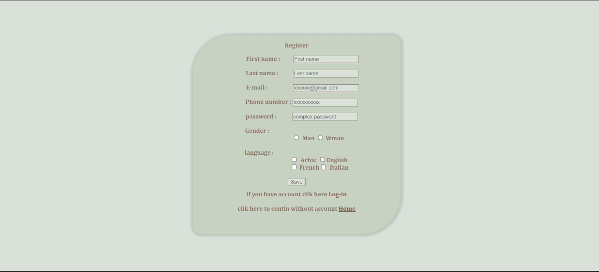
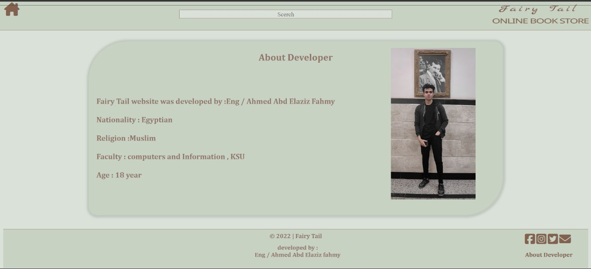

# Fairy Tail - Online Book Store  

### Description  
This is my **first-ever programming project**, created during my first semester in college. It is a simple front-end website for an **Online Book Store** called "Fairy Tail," developed using **HTML** and **CSS** only.

The project was designed to mimic the functionality of an online bookstore, featuring:  
- A **Login** and **Register** page.  
- A **Home page** showcasing books and their categories.  
- A **section for Dr. Mostafa Mahmoud**, displaying his books and information about him.  
- Detailed book pages, providing information, cover images, and descriptions.  

---

### Features  
1. **Home Page**:  
   - Displays a grid of books in the center.  
   - Categories on the right (e.g., Romance, Scientific, Novels).  
   - Authors listed on the left; clicking an author's name navigates to their page.  

2. **Author Section**:  
   - Includes a page for Dr. Mostafa Mahmoud.  
   - Displays his biography and a list of his books.  
   - Clicking a book navigates to a detailed page about that book.  

3. **Book Details**:  
   - Information about the book.  
   - Cover image.  
   - List of chapters and a brief description of each chapter.  

4. **Authentication**:  
   - Simple login and register forms.  

---

### Technologies Used  
- **HTML**  
- **CSS**

---

### Screenshots  
#### Home Page  
  

#### Author Section  
  

#### Book Page  
  

#### Login Page  
  

#### Register Page  
  

#### About Developer  
  

---

### How to Run  
1. Download or clone the repository.  
2. Open the `welcome.html` file in any browser to view the project.  

---

### About  
This project was created in **2022** as part of my college coursework. It represents my first step into the world of programming and web development.  

---

### Developer  
**Ahmed Abd Elaziz Fahmy**  
Student at Faculty of Computers and Information  
Email: [fhmy8308@gmail.com]  
